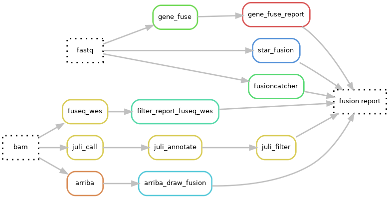

# Hydra-genetics fusions module
The fusions module consists of programs used for finding fusions or translocations in both RNA and DNA short read data. Additional panel specific filtering and merging can be necessary. 

## Fusion callers

| Caller | Type | Comment |
|-|-|-|
| [FuSeq_WES](https://github.com/nghiavtr/FuSeq_WES) | DNA | Uses all transcripts |
| [GeneFuse](https://github.com/OpenGene/GeneFuse) | | Uses only selected transcripts |
| [JuLI](https://github.com/sgilab/JuLI) | _ _ | Uses all transcripts |
| [Arriba](https://github.com/suhrig/arriba) | RNA | Uses external STAR aligner |
| [STAR-Fusion](https://github.com/STAR-Fusion/STAR-Fusion) | | Uses built in STAR aligner |
| [FusionCatcher](https://github.com/ndaniel/fusioncatcher) | _ _ | Uses several built in aligners |

## Dag graph

## Module input files
Depending on the fusion caller the input files are either bam-files or fastq-files. Ctat-splicing also requires a junction file from star aligner.

* `alignment/samtools_merge_bam/{sample}_{type}.bam`
* `alignment/star/{sample}_{type}.bam`
* `prealignment/merged/{sample}_{type}_fastq1.fastq.gz`
* `prealignment/merged/{sample}_{type}_fastq2.fastq.gz`
* `alignment/star/{sample}_{type}.SJ.out.tab`

## Module output files
The fusion results are reported in simple text format files.

* `fusions/filter_fuseq_wes/{sample}_{type}.fuseq_wes.report.csv`
* `fusions/gene_fuse_report/{sample}_{type}_gene_fuse_fusions_report.txt`
* `fusions/juli_call/{sample}_{type}.annotated.filtered.txt`
* `fusions/arriba/{sample}_{type}.fusions.tsv`
* `fusions/star_fusion/{sample}_{type}/star-fusion.fusion_predictions.abridged.tsv"`
* `fusions/fusioncatcher/{sample}_{type}/final-list_candidate-fusion-genes.hg19.txt`
* `fusions/ctat_splicing_filter/{sample}_{type}.cancer.introns.filtered.tsv`